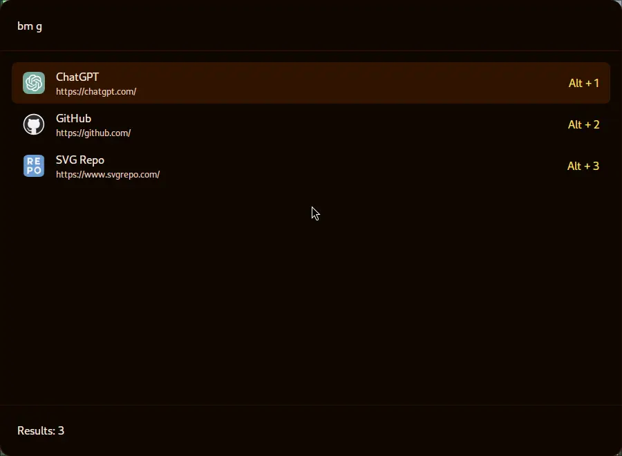

# Bookmarks

This is an extension for tigris to manage your bookmarks. This is way you can switch browsers and always have your favourite websites at the tip of your fingers.

With the extension you can create/edit/delete bookmarks and groups of bookmarks. A group is essentially a collection of bookmarks that open at the same time. For example if you use AI a lot you can have a group that open chatgpt and claude all in one go.

